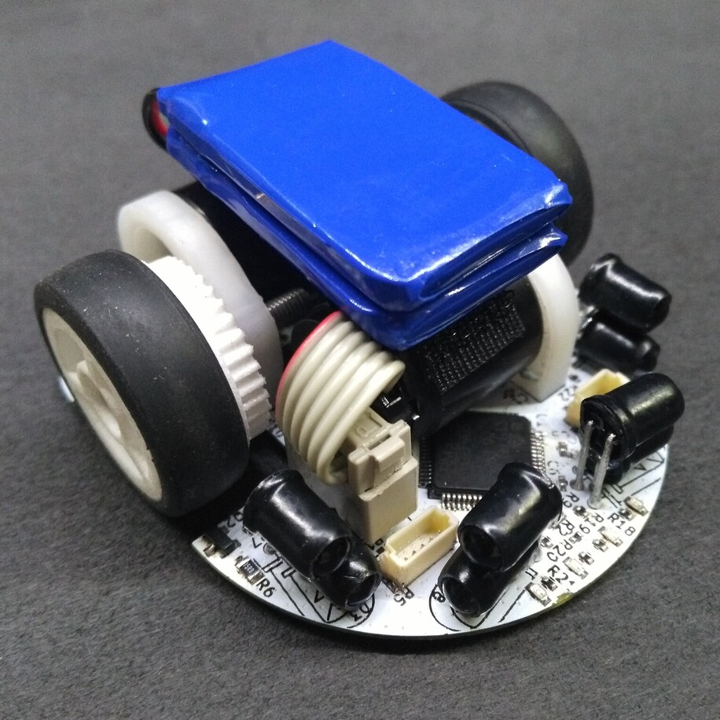

# MicroMouse KERISE v2

クラッシクサイズおよびハーフサイズ兼用マイクロマウス

## 戦績

なし

## スペック

| 部品             | 型番            | 備考                    |
| :--------------- | :-------------- | :---------------------- |
| モーター         | 1717T006SR      | 17mm x 17mm             |
| エンコーダ       | IEH2-1024       | 1024パルス モーター直結 |
| マイコン         | STM32F405RG     | 168MHz                  |
| 赤外線LED        | VSLY5850        | 波長850mm 直径5mm       |
| フォトダイオード | SFH213FA        | 波長900nm 直径5mm       |
| モータードライバ | DRV8835         | 最大電流3A              |
| 6軸センサ        | MPU6500         | 3軸ジャイロ+3軸加速度   |
| バッテリー       | LG325-0120-1S-M | 3.7V 25C 120mAh 1S      |

## 回路設計

- KiCad

## 開発環境

- mbed RTOS
